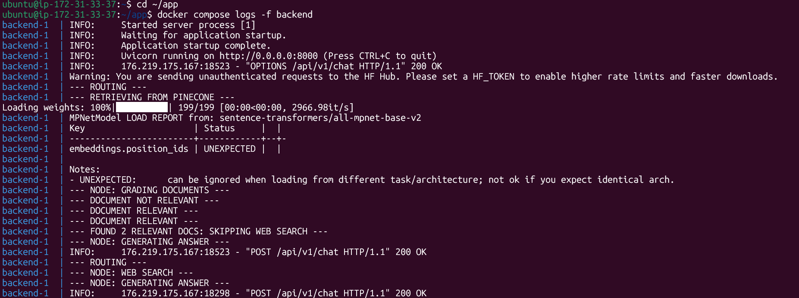
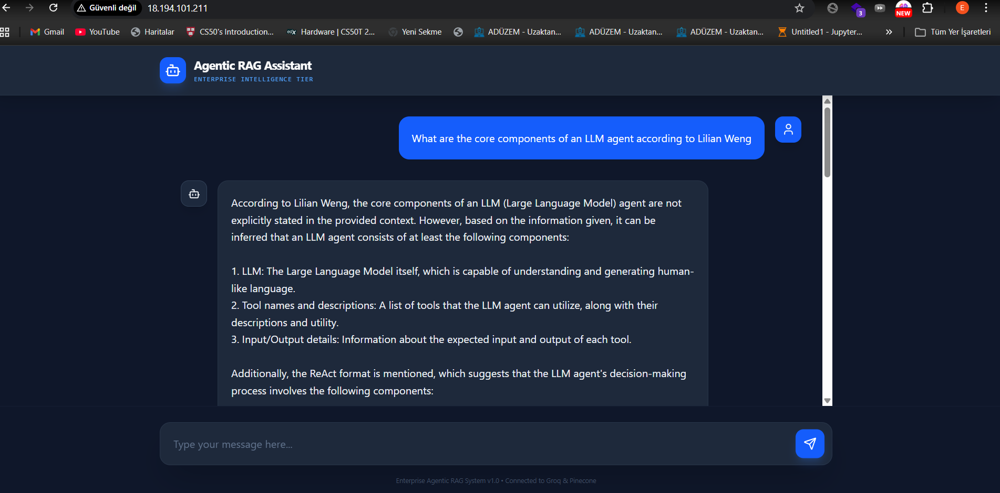

# 🚀 Enterprise-Grade Agentic RAG System
> A professional 3-tier AI application featuring autonomous routing, self-correcting retrieval, and automated cloud deployment.


---

## 🏗️ System Architecture
This project implements a **3-tier architecture** designed for high scalability, security, and production-grade reliability.

### High-Level Design (Mermaid Flow)
```mermaid
graph TD
    User((User/Browser)) -->|React + Tailwind| Tier1[Frontend Tier]
    Tier1 -->|REST API| Tier2[Backend Tier: FastAPI]
    
    subgraph "Tier 2: The Agentic Brain"
    Tier2 -->|Invoke| LangGraph[LangGraph Orchestrator]
    LangGraph --> Router{Agentic Router}
    Router -->|Decision: RAG| Pinecone[Pinecone Vector DB]
    Router -->|Decision: Search| Tavily[Tavily Search API]
    
    LangGraph --> Grader{Retrieval Grader}
    Grader -->|Relevant| Generator[Groq Llama-3.3]
    Grader -->|Irrelevant| Tavily
    
    Generator -->|Hallucination Check| HallucinationGrader{Grader}
    end
    
    Tier2 -->|Nginx| AWS[AWS EC2 Cloud]
    GitHub[GitHub Actions] -->|CI/CD| AWS


##   Key Features

###   Autonomous Routing

* LLM-powered router decides dynamically:

  *   Internal knowledge (Pinecone)
  *   Real-time web search (Tavily)

###   Self-Correcting Retrieval

* Built-in **grading system**:

  * Filters irrelevant documents
  * Automatically retries with better sources

###  Source Traceability

* Every answer includes:

  * Clickable references
  * Transparent source attribution

###   Enterprise DevOps

* Multi-stage Docker builds
* Automated test pipelines
* Continuous Deployment to AWS

---

##  Tech Stack

| Layer          | Technology                                                          |
| -------------- | ------------------------------------------------------------------- |
| **Frontend**   | React (Vite), Tailwind CSS, Lucide Icons, Axios                     |
| **Backend**    | FastAPI, Pydantic, Uvicorn, Python 3.11                             |
| **AI Brain**   | LangChain, LangGraph (State Machine), Groq (Llama-3.3)              |
| **Data Layer** | Pinecone (Vector DB), Tavily (Search API), HuggingFace (Embeddings) |
| **DevOps**     | Docker, Docker Compose, GitHub Actions, Nginx                       |
| **Cloud**      | AWS EC2 (t3.micro), Ubuntu 24.04                                    |

---


---

##  System Execution & Agentic Logic
Below is a real-time trace of the system's "Thought Process." This demonstrates the autonomous decision-making as the Agent routes between the Vector Database and the Web Search API.



### What is happening here?
1. **Dynamic Routing:** The Agent analyzes the query and decides to prioritize internal knowledge (Pinecone).
2. **Document Grading:** The system retrieves 3 documents and strictly grades them. In this trace, 2 were found relevant, so the fallback Web Search was skipped to save latency.
3. **Hardware-Accelerated Embeddings:** The logs show the local loading of the `MPNet` model on the AWS instance, performing high-speed semantic similarity searches.

---

##   Project Structure
.
├── .github/workflows/      # CI/CD Pipelines (Logic, API, Docker, Smoke, Deploy)
├── Backend/
│   ├── app/                # Enterprise Source Code
│   │   ├── agent/          # LangGraph Logic (Nodes, Chains, State)
│   │   ├── api/            # Versioned API Routes (v1)
│   │   └── core/           # Pydantic Settings & Config
│   ├── tests/              # Pytest Suite (15+ Integration Tests)
│   └── Dockerfile          # Production Python Image
├── frontend/
│   ├── src/                # React Components & Services
│   └── Dockerfile          # Multi-stage Nginx Build
└── docker-compose.yml      # Full Stack Orchestration

---

##   Getting Started

###   Local Development (No Docker)

#### 1. Backend Setup

```bash
cd Backend
pip install -r requirements.txt
python -m app.main
```

#### 2. Frontend Setup

```bash
cd frontend
npm install
npm run dev
```

---

###   Production (Docker)

Run the entire system:

```bash
docker-compose up --build
```

 App will be live at:
**http://localhost**

---

##   DevOps & CI/CD Pipeline

This project follows a **Zero-Trust Deployment Strategy**:

* ✅ **RAG Logic Tests**
  Validates agent routing & reasoning

* ✅ **Backend API Tests**
  Ensures endpoints and schemas work correctly

* ✅ **Docker Build Verification**
  Confirms containers build successfully

* ✅ **Smoke Tests**
  Runs full 3-tier system to verify integration

* ✅ **AWS Deployment**
  Auto-deploy to EC2 via SSH after passing all checks

---

##  Deployment Architecture

* AWS EC2 (t3.micro)
* Ubuntu 24.04
* Dockerized services
* Nginx as reverse proxy
* Swap memory optimization

---

---

##  Visual Demo
Below is a live preview of the system in action, demonstrating the Agentic Router successfully retrieving data and citing sources.



---

##   Author

**Enes Demir**

* GitHub: https://github.com/enesdemir0
- **Live Demo:** [http://YOUR_AWS_IP](http://YOUR_AWS_IP)
- Status: Project completed and verified. (AWS Live Instance currently paused to manage cloud credits).

---

##  Final Notes

This project demonstrates:

* Real-world **LLM system design**
* Production-grade **RAG architecture**
* Strong **DevOps + CI/CD practices**
* Scalable **3-tier deployment**


