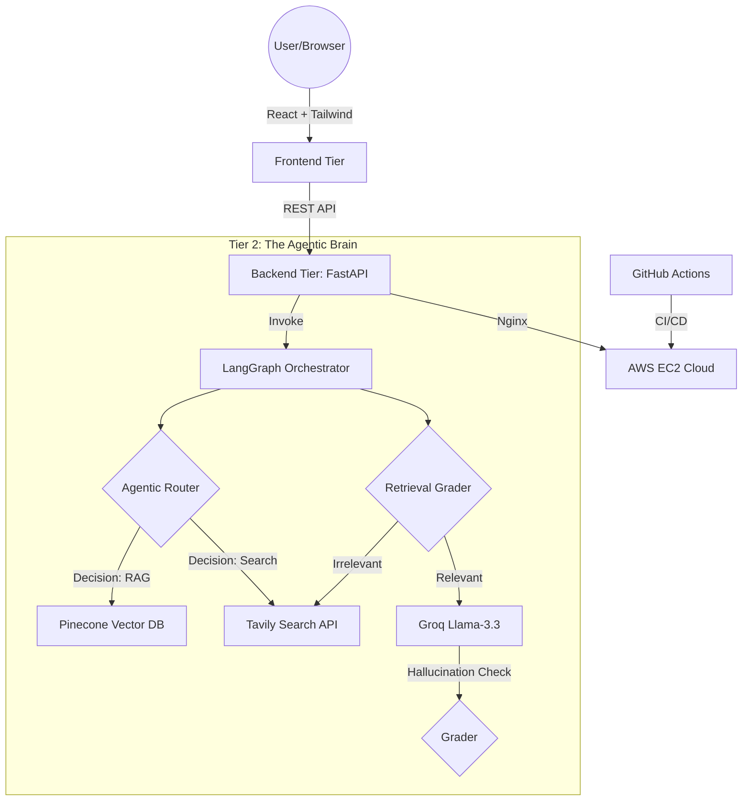

# 🚀 Enterprise-Grade Agentic RAG System
> A professional 3-tier AI application featuring autonomous routing, self-correcting retrieval, and automated cloud deployment.


---

## 🏗️ System Architecture
This project implements a **3-tier architecture** designed for high scalability, security, and production-grade reliability.

### High-Level Design (Mermaid Flow)


📸 Visual Demo  
Below is a live preview of the system in action, demonstrating the Agentic Router successfully retrieving data and citing sources with clickable links.  


⚙️ System Execution & Agentic Logic  
Below is a real-time trace of the system's "Thought Process." This demonstrates the autonomous decision-making as the Agent routes between the Vector Database and the Web Search API.  


### What is happening here?
- **Dynamic Routing:** The Agent analyzes the query and decides to prioritize internal knowledge (Pinecone).  
- **Document Grading:** The system retrieves 3 documents and strictly grades them. In this trace, 2 were found relevant, so the fallback Web Search was skipped to save latency.  
- **Hardware-Accelerated Embeddings:** The logs show the local loading of the MPNet model on the AWS instance, performing high-speed semantic similarity searches.  

---

## 🌟 Key Features
- **Autonomous Routing:** Uses a Llama-3.3-powered router to intelligently decide between internal documentation (Pinecone) and real-time web search (Tavily).  
- **Self-Correcting Retrieval:** Implements a grading loop that filters irrelevant documents and triggers fallback web searches automatically.  
- **Source Traceability:** Full metadata integration—users receive clickable blue links and clean text snippets for every referenced source.  
- **Enterprise DevOps:** Multi-stage Docker builds, automated testing (Logic, API, and Smoke tests), and Continuous Deployment (CD) to AWS.  

---

## 🛠️ Tech Stack

| Component | Technology |
|----------|-----------|
| Frontend | React (Vite), Tailwind CSS, Lucide Icons, Axios |
| Backend | FastAPI, Pydantic, Uvicorn, Python 3.11 |
| AI Brain | LangChain, LangGraph (State Machine), Groq (Llama-3.3) |
| Data Layer | Pinecone (Vector DB), Tavily (Search API), HuggingFace (Embeddings) |
| DevOps | Docker, Docker Compose, GitHub Actions, Nginx |
| Cloud | AWS EC2 (t3.micro), Ubuntu 24.04, Linux Swap Management |

---

## 📂 Project Structure

```text
.
├── .github/workflows/      # CI/CD Pipelines (Logic, API, Docker, Smoke, Deploy)
├── Backend/
│   ├── app/                # Enterprise Source Code
│   │   ├── agent/          # LangGraph Logic (Nodes, Chains, State)
│   │   ├── api/            # Versioned API Routes (v1)
│   │   └── core/           # Pydantic Settings & Config
│   ├── tests/              # Pytest Suite (15+ Integration Tests)
│   └── Dockerfile          # Production Python Image
├── frontend/
│   ├── src/                # React Components & Services
│   └── Dockerfile          # Multi-stage Nginx Build
└── docker-compose.yml      # Full Stack Orchestration
```

---

## 🚀 Getting Started

### Local Development (No Docker)

**Backend Setup:**
```bash
cd Backend
pip install -r requirements.txt
python -m app.main
```

**Frontend Setup:**
```bash
cd frontend
npm install
npm run dev
```

---

### Production Launch (Docker Compose)

Run the entire 3-tier stack with a single command:

```bash
docker compose up --build
```

The app will be live at http://localhost.

---

## 🛡️ DevOps & CI/CD Pipeline

This project follows a "Zero-Trust" deployment strategy with 4 layers of validation:

- **RAG Logic Test:** Verifies the Agent's decision-making paths and chain outputs.  
- **Backend API Test:** Ensures endpoints are responsive and Pydantic schemas are valid.  
- **Docker Build Verify:** Confirms that container images build successfully on Linux.  
- **Smoke Test:** Orchestrates the full 3-tier stack to verify inter-service communication.  
- **AWS Deployment:** Auto-deploy to EC2 via SSH after passing all checks.  

---

## 👤 Author

**Enes Demir**  
GitHub: enesdemir0  


**Status:** Project completed and verified. (AWS Live Instance currently paused to manage cloud credits).
